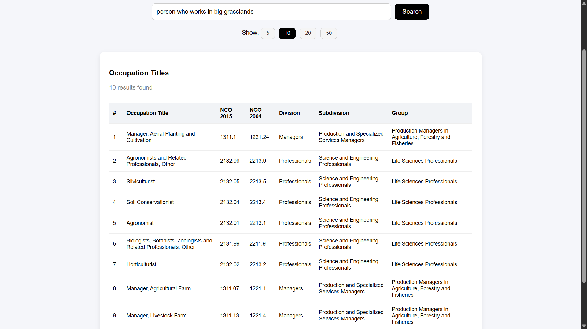

# semantic-nco: semantic search over nco-2015

This project implements semantic search over the NCO-2015 occupation dataset.

Pipeline overview:  
scrape website → generate descriptions → embeddings → FAISS vector index → FastAPI backend → Next.js frontend.

The system retrieves occupations based on semantic similarity instead of simple keyword matching.

---

# TODOS for ETL

- [ ] Improve semantic ranking quality  
- [ ] Add pagination for search results  
- [ ] Expand dataset beyond 500 rows  
- [ ] Add structured filtering (division / group)  

---

# Demo

Add screenshots inside the `assets/` folder and reference them here:

  
  


---

# Future expansion aside from prototype

- Standardized query processor  
- Multilingual query support (translation + semantic mapping)  
- Auto-dispatch between syntactic and semantic search  
- Relational database integration for filtering and grouping  
- Caching layer for faster repeated queries  
- Deployment to cloud infrastructure  

---

# What exactly?

## 1. Extraction + preprocessing

`extraction/` handles dataset preparation.

### Data extraction
- Scraped NCO-2015 occupation table  
- Cleaned and structured hierarchy fields  
- Saved structured CSV  

### Description generation
- Generated occupation descriptions using local LLM (Ollama + Gemma)  
- Descriptions improve semantic representation  
- Stored descriptions alongside structured data  

### Embeddings + vectorstore
- Generated embeddings using SentenceTransformers  
- Normalized vectors for cosine similarity  
- Stored embeddings in FAISS vector index  
- Created embedded CSV (500 rows prototype)  

---

## 2. Backend: FastAPI + FAISS

`backend/` exposes search APIs.

### Setup

Python 3.10+

```bash
pip install fastapi uvicorn pandas faiss-cpu sentence-transformers
```

### Run backend

```bash
cd backend
uvicorn main:app --reload
```

Backend runs at:

```
http://127.0.0.1:8000
```

### API endpoints

- `/data` → fetch dataset  
- `/exact_search?query=` → keyword search  
- `/semantic_search?query=&k=` → semantic similarity search  
- `/hybrid_search?query=&k=` → combined ranking  

---

## 3. Frontend: Next.js

`frontend/` contains the UI.

---

## 4. Workflow

1. Scrape and clean NCO dataset into CSV  
2. Generate occupation descriptions  
3. Create embeddings using SentenceTransformers  
4. Normalize vectors and build FAISS index  
5. Start FastAPI backend  
6. Start Next.js frontend  
7. Perform semantic search queries  

---

# Project structure

```
backend/        FastAPI backend
frontend/       Next.js frontend
transform/      embeddings + FAISS index
extraction/     dataset preparation
assets/         screenshots
README.md
```

---

# How semantic search works

1. User enters query  
2. Query converted into embedding  
3. FAISS compares query vector against stored vectors  
4. Nearest vectors retrieved  
5. Results ranked by similarity  
6. Frontend displays structured output  

Lower distance indicates higher similarity when using L2 distance.

---

# Tech stack

## Backend
- FastAPI  
- Python  
- FAISS  
- Pandas  

## AI / NLP
- SentenceTransformers  
- Vector embeddings  
- Cosine similarity  
- Ollama (description generation)  

## Frontend
- Next.js  
- HTML/CSS  
- JavaScript  

GitHub:  
https://github.com/RajanBuchha
